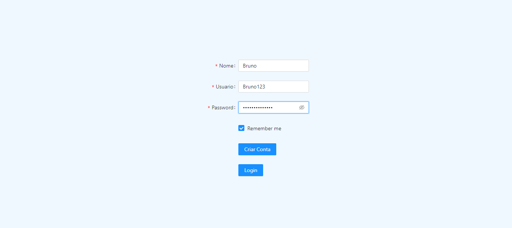
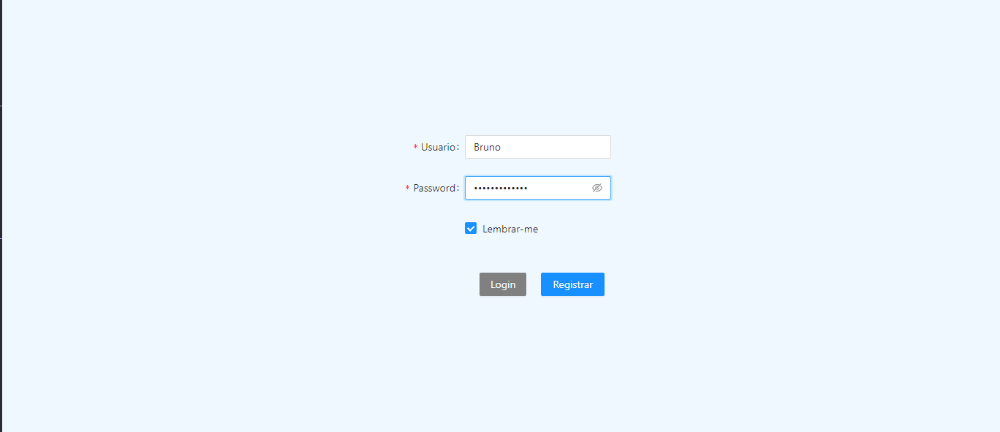

 
 

# Registro de Usuario com criação de Token JWT

  

# Login Usuario com vericação Token JWT

  

# Criação de Produtos

  

# Criação de Clientes

  

# Criação de Vendas

  

# Listagem

  

